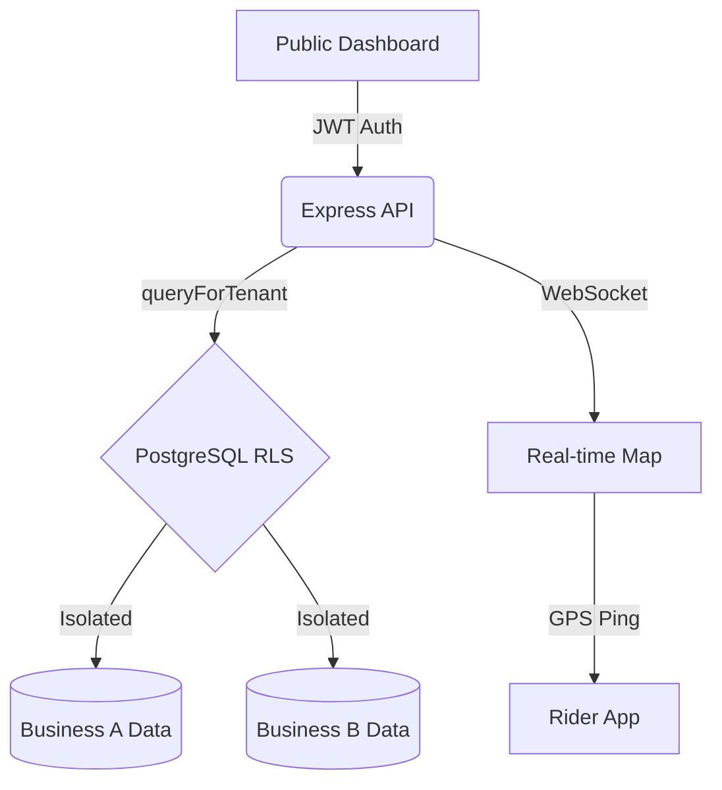

# 📦 Trajex

[](https://github.com/manoj-1407/trajex/actions/workflows/ci.yml)
[](https://nodejs.org/)
[](https://react.dev/)
[](https://www.postgresql.org/)

**Trajex** is a high-performance, multi-tenant delivery dispatch platform built for scale. It provides local delivery businesses with isolated workspaces for live rider tracking, automated dispatching, and real-time order analytics—all within a single, securely partitioned infrastructure.

---

## 🏗️ Core Architecture

Trajex uses a **Security-First** design pattern, offloading tenant isolation to the database layer via PostgreSQL Row Level Security (RLS). This ensures that data leaks are architecturally impossible, even if application-level bugs occur.



---

## 🚀 Key Features

*   **📍 Live Dispatch Map** — Real-time rider tracking with sub-second updates via Socket.io.
*   **🤖 Smart Assignment** — Haversine-optimized rider suggestions based on proximity and load.
*   **🔗 Public Tracking** — Secure, shareable order tracking URLs for customers (no login required).
*   **⚠️ SLA Engine** — Auto-flagging of breach risks with dynamic order-level thresholds.
*   **📊 Business Intelligence** — Multi-tenant analytics for volume, performance, and rider efficiency.
*   **📱 PWA Ready** — Mobile-first rider interface that installs to home screens instantly.

---

## 🛡️ Security Design

*   **Database-Level Isolation** — Every query session is scoped to a specific `business_id` at the Postgres level.
*   **Token Rotation** — JWT refresh tokens are SHA-256 hashed and rotated on every use; replay detection triggers instant family revocation.
*   **CSRF Protection** — Double-submit cookie pattern protecting all mutating state changes.
*   **Auditability** — Immutable, insert-only audit logs enforced by database triggers.
*   **Strict Sanitization** — Global middleware scrubs HTML/script tags from all incoming payloads.

---

## 🛠️ Getting Started

### Prerequisites
- Node.js `^20.0.0`
- PostgreSQL `^16.0`
- Docker (Optional for orchestration)

### Quick Start (Local)
```bash
# 1. Install dependencies
npm run install:all

# 2. Configure environment
cp backend/.env.example backend/.env
# Edit backend/.env with your DATABASE_URL

# 3. Setup Database
psql -U postgres -c "CREATE DATABASE trajex_db;"
cd backend && npm run migrate:up
psql -U postgres -d trajex_db -f rls.sql # Note: Update password in rls.sql first

# 4. Launch Stack
npm run dev
```

### Quick Start (Docker)
```bash
cp .env.docker.example .env.docker
npm run docker:up
```

## 🌐 Production Deployment

### Backend (Railway)
1. Set the **Root Directory** to `/` (Repo Root).
2. The platform will automatically use the root `Dockerfile`.
3. Configure the following **Environment Variables** in the Railway dashboard:
   - `NODE_ENV`: `production`
   - `DATABASE_URL`: Your production Postgres connection string.
   - `JWT_ACCESS_SECRET`: A long, random string.
   - `JWT_REFRESH_SECRET`: Another long, random string.
   - `CORS_ORIGIN`: Your Vercel frontend URL (e.g., `https://trajex.vercel.app`).
   - `FRONTEND_URL`: Same as `CORS_ORIGIN`.

### Frontend (Vercel)
1. Set the **Root Directory** to `/` (Repo Root).
2. Use the following build settings:
   - **Build Command**: `npm run build`
   - **Output Directory**: `frontend/dist`
3. Configure **Environment Variables**:
   - `VITE_API_URL`: Your Railway backend URL (e.g., `https://trajex-production.up.railway.app`).

---

## 🧪 Testing & Quality
```bash
npm run test:backend
```
> **Status:** 44 Intensive Integration Tests passing across Auth, RLS, CSRF, Replay Attack prevention, and Core Business Logic.
> **Code Style:** 100% camelCase API contract enforcement.

## 📄 Credits
Built by **Manoj Kumar**.
